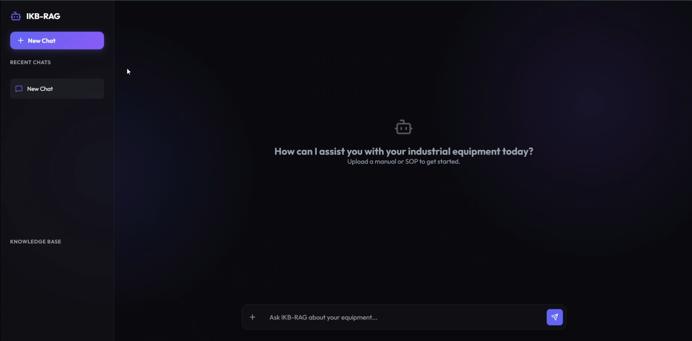

<div align="center">

# 🏭 IKB-RAG
### Industrial Knowledge Base powered by Retrieval-Augmented Generation (RAG)

<p align="center">
An AI-powered Industrial Troubleshooting Assistant built for engineers, maintenance teams, and manufacturing industries.
</p>

<p align="center">


</p>

---

### 📚 Built With

FastAPI • React • Vite • Groq • Qdrant Cloud • MinerU • Nomic Embeddings • Hugging Face Spaces

</div>

---

# 📖 Table of Contents

- 📌 Overview
- ✨ Features
- 🏗 Architecture
- ⚙ Tech Stack
- 🚀 Getting Started
- 📁 Project Structure
- 🔑 Environment Variables
- ▶ Running the Application
- 🌐 Backend API
- 🧠 RAG Pipeline
- 💻 Frontend Features
- ☁ Hugging Face Services
- 📌 Future Improvements
- 🤝 Contributing

---

# 📌 Overview

IKB-RAG is a full-stack AI-powered Industrial Knowledge Assistant that combines Retrieval-Augmented Generation (RAG) with multimodal document understanding to help engineers diagnose industrial equipment failures quickly and accurately.

Unlike traditional chatbots, IKB-RAG understands:

- 📄 Industrial manuals
- 📊 Tables
- 📈 Technical diagrams
- 🧮 Mathematical formulas
- 📝 Maintenance reports

using **MinerU's multimodal parsing engine**, stores document embeddings inside **Qdrant Cloud**, and generates contextual expert responses through **Groq's Llama 3 models**.

The result is an intelligent troubleshooting assistant capable of delivering highly accurate answers with precise document citations.

---

# ✨ Key Features

## 🤖 AI Powered Troubleshooting

- Industrial domain-specific RAG pipeline
- Root Cause Analysis (RCA)
- Equipment diagnostics
- Context-aware answers
- Expert-level troubleshooting

---

## 📄 Intelligent PDF Processing

✔ OCR

✔ Tables

✔ Mathematical equations

✔ Engineering diagrams

✔ Layout detection

✔ Structured document parsing

Powered by **MinerU**

---

## 🔎 Semantic Search

- Vector embeddings
- Parent Document Retrieval
- Context reconstruction
- Citation-aware responses
- Exact page references

---

## ☁ Cloud Native

- Qdrant Cloud
- Hugging Face Spaces
- Stateless backend
- Scalable architecture
- Persistent vector storage

---

## 🎨 Modern User Interface

- Glassmorphism design
- Animated upload pipeline
- Built-in PDF viewer
- Responsive layout
- Interactive chat experience

---

# 🏗 Architecture

```text
                   +----------------------+
                   |      User Upload     |
                   +----------+-----------+
                              |
                              ▼
                     PDF Processing
                         (MinerU)
                              |
                              ▼
              Structured Content Extraction
      Text | Tables | Images | Equations | Layout
                              |
                              ▼
                   Nomic Embeddings API
                              |
                              ▼
                 Qdrant Vector Database
                              |
                              ▼
                     Semantic Retrieval
                              |
                              ▼
                Parent Document Retrieval
                              |
                              ▼
                    Groq Llama 3 Model
                              |
                              ▼
                   Industrial AI Response
```

---

# ⚙ Tech Stack

| Category | Technologies |
|-----------|--------------|
| Frontend | React, Vite |
| Backend | FastAPI |
| Vector Database | Qdrant Cloud |
| Embeddings | Nomic Embed Text v1.5 |
| LLM | Groq Llama 3 |
| PDF Parsing | MinerU |
| Hosting | Hugging Face Spaces |
| Language | Python |
| Styling | CSS Glassmorphism |

---

# 📁 Project Structure

```text
IKB-RAG
│
├── frontend/                  
│   ├── src/App.jsx            # Core UI, Chat Interface, PDF Viewer
│   └── src/index.css          # Glassmorphism aesthetic tokens
│
├── pikerag/                   # The Core RAG Engine
│   └── utils/rag_utils.py     # Embeddings, MinerU parsing, Qdrant client, Agents
|
├── uploaded_documents/        # Local cache of active manuals
├── static_images/             # High-res P&IDs extracted by MinerU
├── parsed_data/               # MinerU JSON & Markdown artifacts
│
├── .env
├── README.md
├── api.py
└── requirements.txt
```

---

# 🚀 Live Demo

Experience IKB-RAG in action through the live application and interactive walkthrough.

<div align="center">

&nbsp;

<a href="https://youtu.be/YOUR_VIDEO_ID">
  
</a>

</div>

<br>

<p align="center">
  <a href="https://youtu.be/YOUR_VIDEO_ID">
    
  </a>
</p>

<p align="center">
<b>👆 Click the thumbnail above to watch the complete project walkthrough.</b>
</p>


## ✨ What You'll See

- 📄 Upload and parse industrial PDF manuals
- 🔍 Semantic document retrieval using RAG
- 🤖 AI-powered troubleshooting with Groq Llama 3
- 📑 Source-aware responses with page citations
- 🖼️ Automatic extraction of tables, diagrams, and images
- ☁️ Persistent vector storage using Qdrant Cloud
- 🎨 Modern glassmorphism-based user interface

---

# 🚀 Getting Started

## Prerequisites

Before running the project, make sure you have installed:

- Python 3.10+
- Node.js 18+
- npm
- Git

You will also need API keys for:

- Hugging Face
- Groq
- Nomic
- Qdrant Cloud

---

# 🔑 Environment Variables

Create a `.env` file in the root directory.

```env
HF_TOKEN=your_huggingface_token

GROQ_API_KEY=your_groq_api_key

NOMIC_API_KEY=your_nomic_api_key

QDRANT_URL=https://your-cluster-url.cloud.qdrant.io:6333

QDRANT_API_KEY=your_qdrant_api_key
```

---

# 📦 Install Backend

```bash
pip install fastapi

pip install uvicorn

pip install python-multipart

pip install requests

pip install groq

pip install qdrant-client

pip install python-dotenv
```

or simply

```bash
pip install -r requirements.txt
```

---

# ▶ Start Backend

```bash
python api.py
```

When the backend starts, it automatically performs a diagnostic health check:

- ✅ Groq Connection
- ✅ Hugging Face API
- ✅ Qdrant Database
- ✅ Environment Variables

Backend URL

```
http://localhost:8002
```

---

# 💻 Frontend Installation

Open a new terminal.

```bash
cd frontend
```

Install packages

```bash
npm install
```

Start development server

```bash
npm run dev
```

Frontend URL

```
http://localhost:5173
```

---

# 🚦 Application Workflow

```text
Start Backend
      │
      ▼
Start Frontend
      │
      ▼
Upload PDF
      │
      ▼
MinerU extracts document
      │
      ▼
Embeddings generated
      │
      ▼
Stored inside Qdrant
      │
      ▼
Ask Questions
      │
      ▼
Relevant Context Retrieved
      │
      ▼
Groq Generates Final Answer
```

---

# 🌟 Highlights

- ⚡ Low latency responses
- 📄 Accurate document citations
- 🧠 Parent Document Retrieval
- ☁ Fully cloud scalable
- 🔒 Secure session isolation
- 📊 Engineering-focused responses
- 🎨 Modern responsive UI

---

# 🌐 Backend API

The FastAPI backend exposes a clean REST API responsible for document management, vector indexing, retrieval, and chat lifecycle management.

---

## 📡 API Endpoints

| Method | Endpoint | Description |
|----------|----------|-------------|
| POST | `/upload` | Uploads a PDF, extracts its contents, generates embeddings, and indexes them into Qdrant. |
| GET | `/documents` | Retrieves all uploaded documents for a chat session. |
| GET | `/documents/{chat_id}/{filename}` | Opens the original uploaded PDF. |
| GET | `/images/{chat_id}/{pdf_base}/{filename}` | Serves extracted engineering diagrams and images. |
| POST | `/query` | Accepts user queries and streams AI-generated responses. |
| POST | `/chat/{chat_id}/refresh` | Re-indexes all uploaded documents. |
| DELETE | `/chat/{chat_id}` | Permanently deletes all chat data, vectors, images, and uploaded files. |

---

## 🔄 API Workflow

```text
Client
   │
   ▼
FastAPI
   │
   ├── Upload PDF
   ├── Extract Content
   ├── Generate Embeddings
   ├── Store in Qdrant
   └── Return Status

Query Request
      │
      ▼
Retrieve Relevant Chunks
      │
      ▼
Groq LLM
      │
      ▼
Streaming Response
```

---

# 🧠 RAG Pipeline

The Retrieval-Augmented Generation pipeline is designed specifically for industrial documentation, where preserving structure and context is essential.

---

## 📄 Step 1 — Document Parsing

Every uploaded PDF is processed by **MinerU**, which extracts:

- 📄 Paragraphs
- 📊 Tables
- 📈 Engineering Charts
- 🖼 Diagrams
- 🧮 Mathematical Formulae
- 📑 Document Layout
- 🔤 OCR Text

Unlike traditional PDF parsers, MinerU preserves the structural hierarchy of technical documents.

---

## ✂ Step 2 — Intelligent Chunking

Instead of splitting documents by arbitrary token limits, the engine separates content based on structural elements.

Each chunk represents:

- One paragraph
- One table
- One image
- One formula
- One engineering block

This significantly improves retrieval precision.

---

## 🧬 Step 3 — Embedding Generation

Each extracted chunk is converted into a high-dimensional vector using:

**Nomic Embed Text v1.5**

Benefits include:

- Semantic similarity
- Fast vector search
- Context preservation
- High retrieval accuracy

---

## ☁ Step 4 — Vector Storage

Embeddings are stored inside **Qdrant Cloud**.

Each vector stores:

- Chat ID
- PDF filename
- Page number
- Chunk type
- Source citation
- Metadata

This enables efficient filtering and scalable search.

---

## 🔎 Step 5 — Semantic Retrieval

When a question is asked:

1. Generate query embedding
2. Search nearest vectors
3. Retrieve highest-scoring chunks
4. Reconstruct surrounding context
5. Send enriched prompt to Groq

---

## 🧩 Parent Document Retrieval

Instead of sending isolated chunks to the LLM, the engine retrieves the surrounding page or section to provide additional context.

Benefits:

- Better reasoning
- Reduced hallucinations
- Improved engineering accuracy
- More natural answers

---

## 🤖 Step 6 — LLM Response Generation

Groq's Llama 3 model receives:

- User question
- Retrieved context
- Source metadata
- Industrial system prompt

The model generates an expert-level troubleshooting response while maintaining strict industrial guardrails.

---

# 🔒 AI Guardrails

The assistant is intentionally restricted to industrial engineering domains.

It will:

✅ Explain industrial equipment

✅ Analyze manuals

✅ Diagnose failures

✅ Provide maintenance guidance

✅ Perform Root Cause Analysis

It refuses:

❌ General knowledge

❌ Casual conversations

❌ Irrelevant programming queries

❌ Off-topic requests

unless directly related to industrial systems.

---

# 💻 Frontend Features

The frontend is built using **React + Vite** with a modern glassmorphism interface.

---

## 🎨 User Experience

### ✨ Glassmorphism Design

- Frosted panels
- Gradient accents
- Soft shadows
- Blur effects
- Smooth animations

---

### 📂 Interactive Upload Experience

Instead of a loading spinner, users see a live processing pipeline showing:

```
Uploading PDF...

Parsing Layout...

Extracting Tables...

Extracting Images...

Generating Embeddings...

Uploading to Qdrant...

Ready!
```

---

### 📑 Integrated PDF Viewer

Features:

- Open original PDF
- Jump directly to cited page
- Side-by-side reading
- Source verification

---

### 💬 AI Chat Interface

Features include:

- Streaming responses
- Markdown rendering
- Code blocks
- Hyperlinks
- PDF citations
- Image references

---

### 🗑 Safe Chat Management

Includes elegant confirmation dialogs before:

- Deleting chats
- Removing documents
- Clearing vector database

---

# ☁ Hugging Face Microservices

Heavy computation is outsourced to Hugging Face Spaces, keeping deployment lightweight.

---

## 📄 MinerU Service

Responsible for:

- OCR
- Layout detection
- Table extraction
- Image extraction
- Formula recognition

Input:

```
PDF
```

Output:

```
content_list.json
images/
metadata
```

---

## 🧬 Nomic Embedding Service

Responsible for generating semantic embeddings.

Advantages:

- Fast
- Cloud-hosted
- GPU accelerated
- Highly accurate

---

# 📊 Performance Highlights

| Feature | Benefit |
|----------|----------|
| Parent Retrieval | Better context |
| Cloud Vectors | Scalable search |
| Streaming LLM | Low latency |
| MinerU Parsing | Rich document understanding |
| Glass UI | Excellent UX |
| Session Isolation | Secure multi-user support |


---

# 📈 Roadmap

## ✅ Completed

- PDF Upload
- MinerU Integration
- Vector Search
- Groq Integration
- Glassmorphism UI
- Citation Navigation

---

## 🚧 In Progress

- Multi-document reasoning
- Conversation memory
- Authentication
- User dashboard
- Search history

---

## 🔮 Planned

- Voice Assistant
- Mobile App
- OCR for Images
- Knowledge Graph
- Local LLM Deployment
- Docker Deployment
- Kubernetes Support

---

# 🤝 Contributing

Contributions are welcome!

### Steps

```bash
Fork Repository

Clone Repository

Create Feature Branch

Commit Changes

Push Branch

Create Pull Request
```

---

# 📜 License

This project is licensed under the **MIT License**.

Feel free to use, modify, and distribute this project under the terms of the license.

---

# 💡 Future Vision

IKB-RAG aims to become a complete AI-powered Industrial Knowledge Platform capable of assisting engineers throughout the equipment lifecycle - from installation and maintenance to diagnostics, predictive analytics, and intelligent documentation search.

Future enhancements will focus on expanding multimodal understanding, improving collaboration features, and integrating with enterprise systems.

---

# 🙌 Acknowledgements

Special thanks to the amazing open-source community and technologies powering this project.

❤️ FastAPI

⚛ React

⚡ Vite

🧠 Groq

📄 MinerU

☁ Hugging Face

📦 Qdrant

🧬 Nomic AI

---

<div align="center">

## ⭐ If you found this project useful...

Give it a ⭐ on GitHub and consider contributing!

Made with ❤️ for Industrial AI, Manufacturing, and Engineering Innovation.

---

**IKB-RAG — Industrial Knowledge Base powered by Retrieval-Augmented Generation**

</div>